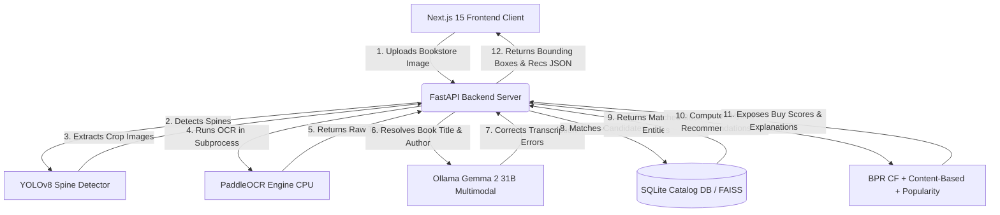

# ShelfSense AI 📚✨

> **Bookstore Shelf Scan & Personalized Book Recommendation Platform**

ShelfSense AI is a portfolio-grade, production-quality AI-powered bookstore recommendation platform designed to help readers discover books while browsing physical bookstore shelves. 

A user selects their reading preferences (onboarding). They then take a photo of a bookstore shelf. The CV pipeline detects the book spines, runs high-performance OCR, uses a local Large Language Model (LLM) to correct OCR errors and identify titles/authors, matches them to a local SQLite catalog database, and recommends which books the user is most likely to enjoy based on their Reading DNA.

---

## 🏗️ System Architecture

ShelfSense AI integrates computer vision, deep learning, natural language processing, vector search, and web technologies into a clean, modern application.



### 🔬 Core Components & Tech Stack

1. **Frontend**: Next.js 15, React, and TailwindCSS, featuring a clean dark-mode interface, drag-and-drop shelf scanner, dynamic canvas bounding-box viewer, and detailed recommendation screens.
2. **Backend**: FastAPI (Python 3.10+), SQLAlchemy ORM, and SQLite.
3. **Computer Vision**: YOLOv8 (nano) trained on a custom book spine bounding-box dataset.
4. **OCR**: PaddleOCR (CPU-based) batching, optimized to avoid PyTorch GPU resource contention on Windows and to automatically handle vertical and rotated text.
5. **Entity Identification**: Ollama local multimodal inference using `gemma2:27b` / `gemma4:31b-cloud` to resolve book metadata from noisy OCR outputs and spine images.
6. **Recommendation Engines**:
   - **Collaborative Filtering (BPR)**: PyTorch-implemented Bayesian Personalized Ranking model trained on Book-Crossing ratings.
   - **Content-Based Filtering**: Sentence-Transformers embeddings with cosine similarity neighbors cached locally.
   - **Popularity & Genre DNA Booster**: Blends popularity statistics and matches the candidate book's genres against the user's computed **Reading DNA** profile.

---

## 📂 Project Structure

```
├── backend/
│   ├── database.py             # SQLAlchemy models & schema definitions
│   ├── main.py                 # FastAPI API endpoints & auth handlers
│   ├── seed_db.py              # Catalog seeding script
│   ├── verify_recommender.py   # Recommendation pipeline verification
│   └── uploads/                # Directory for user uploads & overlays (gitignored)
├── frontend/                   # Next.js 15 React application
│   ├── src/app/                # React pages, layouts, and styles
│   ├── package.json            # Node dependency list
│   └── next.config.ts          # Next.js configuration
├── models/                     # Small model binaries, weights, and CSV metadata
│   ├── bpr_model.pth           # Trained BPR weights (3.0MB)
│   ├── bpr_config.pth          # BPR config hyperparameters
│   ├── book_embeddings.npy     # FAISS embeddings (9.4MB)
│   └── book_catalog.csv        # OpenLibrary seeded catalog (12.7MB)
├── notebooks/                  # Jupyter notebooks documenting EDA & model training
├── runs/
│   └── detect/train/weights/   # Trained YOLOv8 spine detection weights
│       └── best.pt             # Bounding-box model (6.2MB)
├── src/                        # Core Python library
│   ├── collaborative.py        # Collaborative filtering models
│   ├── content_based.py        # Embedding similarity queries
│   ├── cv_pipeline.py          # YOLO + PaddleOCR + Ollama pipeline
│   ├── hybrid.py               # Blended recommendation scoring & explanations
│   ├── ocr_subprocess.py       # Standalone PaddleOCR CPU batch executor
│   └── numpy_compat.py         # NumPy pickle deserialization adapter
├── requirements.txt            # Python environment dependencies
└── .gitignore                  # Git tracking exclusions
```

---

## ⚡ Setup & Installation

### Prerequisites

- **Python 3.10+**
- **Node.js 18+**
- **Ollama** (locally running instance)
- **CUDA Toolkit** (Optional, but highly recommended for fast YOLOv8 inference)

### 1. Ollama Setup

Install [Ollama](https://ollama.com/) and download the multimodal model used for spine entity resolution:
```bash
ollama pull gemma2:27b
```
*(Make sure the Ollama server is running locally on port `11434` before starting the backend).*

### 2. Python Backend Setup

1. **Create and Activate a Virtual Environment**:
   ```bash
   # Windows Powershell
   python -m venv .venv
   .venv\Scripts\Activate.ps1
   
   # Linux/macOS
   python3 -m venv .venv
   source .venv/bin/activate
   ```

2. **Install Backend Dependencies**:
   ```bash
   pip install -r requirements.txt
   ```

3. **Seed the SQLite Database**:
   Seeding the database builds a local SQLite database (`backend/bookshelf.db`) and seeds it with over 6,100 high-quality books and authors from `models/book_catalog.csv` (OpenLibrary):
   ```bash
   python backend/seed_db.py
   ```

4. **Verify the Recommender Pipeline**:
   Ensure that the recommendation models are loaded and running correctly by running the verification test script:
   ```bash
   python backend/verify_recommender.py
   ```

### 3. Next.js Frontend Setup

1. Open a new terminal window, navigate to the `frontend/` directory:
   ```bash
   cd frontend
   ```

2. **Install Node Packages**:
   ```bash
   npm install
   ```

---

## 🚀 Running the Project

### Start the FastAPI Backend

From the project root (with `.venv` activated):
```bash
uvicorn backend.main:app --reload --port 8000
```
- Interactive Swagger docs will be available at: [http://localhost:8000/docs](http://localhost:8000/docs)
- Redoc API documentation: [http://localhost:8000/redoc](http://localhost:8000/redoc)

### Start the Next.js Frontend

From the `frontend/` directory:
```bash
npm run dev
```
Open your browser to [http://localhost:3000](http://localhost:3000) to access the ShelfSense AI web dashboard.

---

## ⚙️ Git Tracking & Deployment Details

To prevent exceeding GitHub repository storage limits, the project is configured to exclude heavy assets, logs, database files, and local caches.

The following files are **tracked** in Git:
- Complete frontend React files, backend routing handlers, and Python recommender code (`src/` and `backend/`).
- Jupyter notebooks inside the `notebooks/` directory.
- Model configs, lookup indexes, and metadata under `models/` (under 15MB each).
- The custom-trained book spine YOLOv8 detector weights (`runs/detect/train/weights/best.pt`, ~6.2MB).

The following files are **gitignored**:
- The main SQLite database file (`backend/bookshelf.db`, ~112MB) — dynamically generated during seeding.
- Heavy collaborative filtering item-similarity matrices (`models/item_similarity_df.pkl`, ~649MB).
- Raw and processed datasets (`data/raw/`, `data/processed/`).
- Bounding box annotations and crop output files (`outputs/`).
- Frontend Node modules and build files (`node_modules/`, `.next/`).
- Virtual environments (`.venv/`, `venv/`).

> [!NOTE]
> The hybrid recommender is programmed to automatically bypass item-based collaborative filtering if `item_similarity_df.pkl` is missing. It will gracefully compute recommendations using BPR factor scores, genre matches, and content-based embedding neighbors so the app remains fully functional on a clean clone.

---

## 📝 License

This project is licensed under the MIT License - see the LICENSE file for details.
