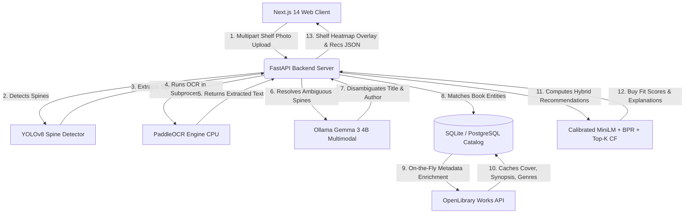

# ShelfSense AI 📚✨

> **AI-Powered Bookstore Shelf Scanner & Hybrid Book Recommendation Engine**

ShelfSense AI is a production-grade, portfolio-ready AI system designed to help readers discover books while browsing physical bookstore shelves. 

A user configures their personal taste profile during onboarding. When they photograph a physical bookstore shelf, the computer vision pipeline detects book spines, runs optical character recognition (OCR) in an isolated subprocess, resolves ambiguous titles using a local Vision LLM (Ollama), matches detected spines against a local catalog of over 291,000 works, and computes personalized Buy Fit scores and contextual reading rationale based on the user's Reading DNA.

---

## 📦 Large Datasets & Model Assets (Google Drive)

All raw datasets, processed CSVs, and the complete SQLite catalog database can be downloaded directly from Google Drive:

👉 **[Download Project Datasets & Database Assets (Google Drive)](https://drive.google.com/drive/folders/14DByZOEQ50B4p4sECdbsQFWJ_-Oz4P1q?usp=sharing)**

To use the pre-built database and datasets:
1. Download the files from the Google Drive link above.
2. Place `bookshelf.db` in `backend/bookshelf.db`.
3. Extract `data/` into the project root directory.

---

## 🏗️ System Architecture


```mermaid
graph TD
    A[Next.js 14 Web Client] -->|1. Multipart Shelf Photo Upload| B(FastAPI Backend Server)
    B -->|2. Detects Spines| C[YOLOv8 Spine Detector]
    C -->|3. Extracts Spines| B
    B -->|4. Runs OCR in Subprocess| D[PaddleOCR Engine CPU]
    D -->|5. Returns Extracted Text| B
    B -->|6. Resolves Ambiguous Spines| E[Ollama Gemma 3 4B Multimodal]
    E -->|7. Disambiguates Title & Author| B
    B -->|8. Matches Book Entities| F[(SQLite / PostgreSQL Catalog)]
    F -->|9. On-the-Fly Metadata Enrichment| H[OpenLibrary Works API]
    H -->|10. Caches Cover, Synopsis, Genres| F
    B -->|11. Computes Hybrid Recommendations| G[Calibrated MiniLM + BPR + Top-K CF]
    G -->|12. Buy Fit Scores & Explanations| B
    B -->|13. Shelf Heatmap Overlay & Recs JSON| A
```

---

## 🔬 Core Components & Technical Innovations

1. **Computer Vision & Spine Detection**:
   - Custom **YOLOv8x** model (`runs/detect/train/weights/best.pt`, 6.2MB) trained on physical bookstore shelves.
   - Dynamic shelf heatmap generator color-coding detected spines by score (Green: Buy Fit $\ge 80\%$, Yellow: Consider $\ge 50\%$, Red: Low $< 50\%$, Orange: Already Read).

2. **Subprocess-Isolated OCR Pipeline**:
   - **PaddleOCR Mobile V4** runs in an isolated CPU subprocess (`src/ocr_subprocess.py`) with vertical character collapsing, eliminating PyTorch GPU C++ runtime thread collisions on Windows.

3. **Multimodal Disambiguation**:
   - **Ollama `gemma3:4b`** vision model handles angled, low-contrast, or stylized spines.
   - **Fast-Path OCR Matcher**: Resolves clean text directly in $< 5\text{ms}$; ambiguous spines are routed to Gemma with graceful fallback.
   - **False-Positive Elimination**: 4-stage matcher enforces string length penalties to eliminate single-word false matches (e.g. the *"Flu"* trap).

4. **Calibrated Hybrid Recommendation Engine**:
   - **MiniLM Semantic Embeddings**: `all-MiniLM-L6-v2` produces 384-dimensional $L_2$-normalized vectors indexed in FAISS (`IndexFlatIP`).
   - **Cosine Calibration**: Raw dot products are mathematically mapped to reader match percentages ($0\% \text{--} 100\%$).
   - **Active-Channel Reweighting**: Solves the cold-start problem for modern books (post-2004) lacking historical Book-Crossing interaction data by dynamically reallocating weight across observable semantic, genre, and author signals.
   - **Compound Genre Matching**: Tokenized matching resolves compound and hyphenated genres (`epic_fantasy` $\to$ `fantasy`, `hard science-fiction` $\to$ `science fiction`).
   - **Item-Item Collaborative Filtering**: Compact 11.8MB Top-K nearest neighbor graph (`models/item_top_neighbors.pkl`, load time $< 0.2\text{s}$).
   - **Neural BPR**: Bayesian Personalized Ranking matrix factorization.

5. **Organic Catalog Expansion**:
   - When a user scans or searches for a modern release not present in Book-Crossing, [`src/enrichment.py`](src/enrichment.py) queries OpenLibrary's Search & Works APIs to fetch official plot synopses, genres, and high-resolution cover art on-the-fly.

6. **Production Security & Database Agnosticism**:
   - **JWT Authentication**: Cryptographic HMAC-SHA256 (`HS256`) tokens with 30-day expiration and RFC 7519 payload claims.
   - **Dual Database Engine**: Local zero-config SQLite (`bookshelf.db`) + production PostgreSQL support with connection pooling (`pool_size=10`, `max_overflow=20`).

---

## 📂 Project Structure

```
├── backend/
│   ├── database.py             # SQLAlchemy models & dual engine (SQLite / PostgreSQL)
│   ├── main.py                 # FastAPI API endpoints & signed JWT auth
│   ├── bookshelf.db            # SQLite catalog database (291k+ books)
│   └── uploads/                # Directory for user uploads & overlays (gitignored)
├── frontend/                   # Next.js 14 App Router application
│   ├── src/app/
│   │   ├── browse/             # Searchable catalog explorer with OpenLibrary fallback
│   │   ├── dashboard/          # Reading DNA radar & wishlist dashboard
│   │   ├── onboarding/         # Reader taste profile calibration carousel
│   │   ├── recommendations/    # Dual-panel shelf heatmap & scored book cards
│   │   └── scan/               # Drag-and-drop shelf scanner studio
│   ├── src/components/         # Navbar, Footer, and UI components
│   └── package.json            # Node dependency list
├── models/                     # Model binaries, configs, and manifests
│   ├── item_top_neighbors.pkl  # Fast item-item similarity graph (11.8MB)
│   ├── bpr_model.pth           # Trained BPR weights (3.0MB)
│   ├── book_embeddings.npy     # FAISS embeddings (9.4MB)
│   ├── book_catalog.csv        # Curated catalog (12.7MB)
│   └── model_manifest.json     # Formal MLOps model registry manifest
├── notebooks/                  # Jupyter notebooks documenting EDA & model training (01 - 12)
├── runs/
│   └── detect/train/weights/   # Trained YOLOv8 spine detection weights (best.pt, 6.2MB)
├── src/                        # Core Python library
│   ├── collaborative.py        # Item-Item CF & BPR loaders
│   ├── content_based.py        # FAISS search & calibrated embeddings
│   ├── cv_pipeline.py          # YOLO + PaddleOCR + Ollama pipeline
│   ├── enrichment.py           # On-the-fly OpenLibrary metadata enricher
│   ├── hybrid.py               # Calibrated hybrid recommendation engine
│   ├── matching.py             # 4-stage deterministic catalog matcher
│   ├── mlops_eval.py           # Offline evaluation & persona benchmark suite
│   ├── numpy_compat.py         # NumPy 2.x pickling compatibility adapter
│   └── ocr_subprocess.py       # Isolated PaddleOCR CPU batch executor
├── tests/                      # Automated unit test suite (19 tests)
├── .github/workflows/ci.yml    # GitHub Actions continuous integration workflow
├── docker-compose.yml          # Multi-container orchestration (Backend, Frontend, Ollama, Postgres)
├── requirements.txt            # Python dependencies
├── start_backend.bat           # 1-click Windows backend launcher
└── start_frontend.bat          # 1-click Windows frontend launcher
```

---

## ⚡ Quick Start

### Option 1: Native Windows / Local Setup

#### Prerequisites
- **Python 3.11+**
- **Node.js 18+**
- **Ollama** running locally with `gemma3:4b` (`ollama run gemma3:4b`)

#### 1. Setup Python Backend
```powershell
# Create and activate virtual environment
python -m venv .venv
.venv\Scripts\Activate.ps1

# Install dependencies
pip install -r requirements.txt
```

#### 2. Start Services
- **Backend**: Double-click `start_backend.bat` or run:
  ```powershell
  uvicorn backend.main:app --reload --port 8000
  ```
  API Docs: [http://localhost:8000/docs](http://localhost:8000/docs)

- **Frontend**: Double-click `start_frontend.bat` or run:
  ```powershell
  cd frontend
  npm install
  npm run dev
  ```
  Web UI: [http://localhost:3000](http://localhost:3000)

---

### Option 2: Production Docker Orchestration

Launch the full stack (FastAPI backend, Next.js frontend, and Ollama) with a single command:

```bash
docker compose up --build
```

To enable managed PostgreSQL instead of SQLite:
```bash
docker compose --profile postgres up --build
```

---

## 🧪 Testing & MLOps Verification

### Automated Unit Test Suite (19 / 19 Passed)
```powershell
.venv\Scripts\pytest.exe tests/ -v
```

| Test Module | Coverage | Status |
| :--- | :--- | :---: |
| `tests/test_api.py` | API health, search, register/login, profile, JWT token structure | **PASSED** |
| `tests/test_database.py` | User creation, ratings, shelf scan schema | **PASSED** |
| `tests/test_matching.py` | Normalization, keywords, exact match, "Flu" trap avoidance | **PASSED** |
| `tests/test_recommendation.py` | CF neighbors, BPR cold start, score normalization, Reading DNA | **PASSED** |

### Offline Persona Benchmark Suite
```powershell
.venv\Scripts\python.exe src/mlops_eval.py
```
Benchmarks model loading latency, FAISS vector indexing, GPU inference speeds, and verifies persona calibration across Fantasy, Sci-Fi, and out-of-domain literature.

---

## 📝 License

Distributed under the MIT License. See `LICENSE` for details.
